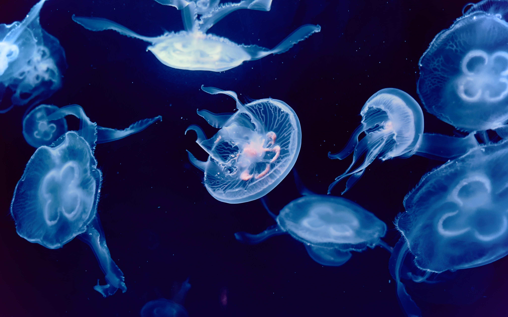

# yche0084_9103_tut08
# Bubble of Emotions Animation Project 1
## How to Interact 2

1. Click the play button and wait for the music to start.
2. Load the page, and the animation will begin automatically.

## Individual Approach 2

I chose to animate the bubbles using a breathing effect that scales their size over time, giving them a rhythmic pulsation. The bubbles also move slowly across the screen.

## Animation Driver 2

I used time-based changes to periodically alter the bubble sizes and create a pulsating effect.

## Animated Properties 2

1. Size Animation: The size of the bubbles changes in a rhythmic pattern, creating a pulsating effect.
2. Movement: The bubbles move slowly across the screen.

## Uniqueness 2
My animation focuses on size and movement, while other group members may animate different properties like color changes or revealing components sequentially.

## Inspiration 2

Since the animation effects already existed in our group's results, as I chose to add more variety to the animation based on timer. The inspiration for making the bubbles shrink and enlarge over time was inspired by this image of a jellyfish floating and contracting and stretching in the deep ocean.

## Technical Explanation 2
My code uses a setInterval function to update the size of the bubbles every 10ms, creating a breathing effect. Perlin noise generates smooth and continuous bubble movements.

## Key Functions 2

1. updateSize(): Updates the size of the bubbles to create a pulsating effect.
2. move(): Allows the bubbles to move slowly on the screen while ensuring they remain within the screen boundaries.
3. display(): Renders the bubbles with a gradient and text that scales with the bubbles' size.

## External Libraries 2

p5.js: Utilized for its robust animation capabilities, making it easier to implement complex movements and interactions.

## Changes to Group Code 2

I refactored the original code to improve performance and added new functions for size animation and movement. The original code only supported static bubbles, so I added the movement and size animation logic.

## External Tools and Techniques 2

- p5.js Library: Used for its robust animation capabilities.
- openprocessing website: Used to search for keywords for inspiration,
- www.sioe.cn website: Used to find reference colours.
- ChatGPT4.0:Used for some ideas and functions that i need but can't achieve.

## Borrowed Techniques 2

- Adapted from the week10 tutorial, a technique for generating Perlin noise provides an easy way to create natural animations.
  
- The random movement of the bubbles was inspired by a code snippet from [openprocessing] (https://openprocessing.org/sketch/2166068), which I modified to meet the needs of my project.